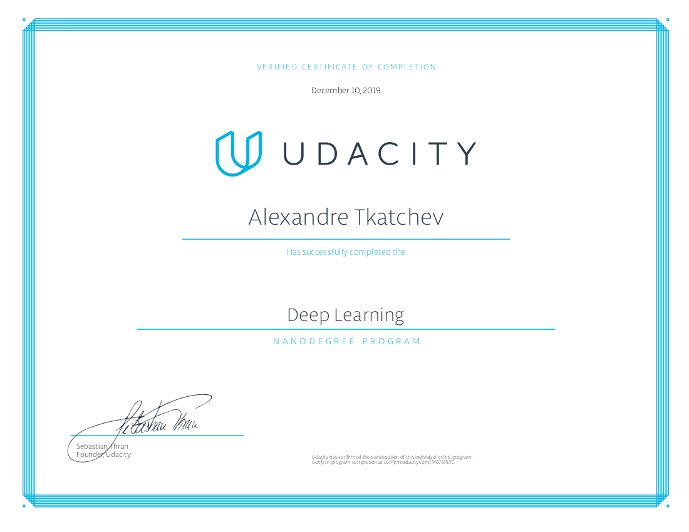

# Deep-Learning-Nanodegree
The Deep Learning Nanodegree program covered cutting-edge topics such as Neural Networks, Convolutional Neural Networks (CNN), Recurrent Neural Networks (RNN), Generative Adversarial Networks (GANs), and Network Deployment using Amazon Web Services (AWS). The program was comprised of 5 courses and 5 projects. 

# Projects 
- [Project 1](https://github.com/atkatchev/bike_sharing_ridership_prediction) - **Predicting Bike-Sharing Patterns** - Designed a **Multi-Layer Neural Network** from scratch using Python and Numpy. Implemented **gradient descent** and **back-propogation** in Python using Numpy and matrix multiplication. The goal of the project is to predict how many bikes the owner of a bike sharing company will need. If there are too few bikes, the business losses money from potential riders. If there are too many bikes the business has wasted money on bikes that are just sitting around. So the neural network predicts from historical data how many bikes will be needed in the near future. 
- [Project 2](https://github.com/atkatchev/dog-breed-classifier) - **Dog Breed Classifier** - Implemented a **Convoltional Neural Network** (CNN) in Pytorch that performs better than the average human when given the task of identifying dog breeds. Given an image of a dog, the CNN produced an estimate of the dog's breed. If supplied an image of a human, the implemented algorithm also produces an estimate of the closest-resembling dog breed. Also applied transfer learning i.e. used a pre-trained model to do the same functionality. Constructed a pipeline that is to be used within a web or mobile app to process real-world, user-supplied images.
- [Project 3](https://github.com/atkatchev/tv_script_generation) - **Generate TV Scripts** - Designed and trained a **Recurrent Neural Network** (RNN) and **Long Short-Term Memory Networks** (LSTM) with PyTorch. Performed sentiment analysis and generated new "fake" Sienfeld TV scripts, that resembles a training set of 9 seasons of Sienfeld TV scripts.
- [Project 4](https://github.com/atkatchev/face-generation) - **Generate Faces** - Designed and trained a Deep Convolutional **Generative Adversarial Network** (GAN) consisting of a pair of multi-layer neural networks that compete against each other until one learns to generate realistic images of human faces. 
- [Project 5](https://github.com/atkatchev/deploying-sentiment-analysis-model) - **Deploy a Sentiment Analysis Model** - Trained and deployed a sentiment analysis model in PyTorch using **Amazon SageMaker** on AWS using **XGBoost**. The model was trained to do sentiment analysis on movie reviews using the IMDB data set (positive or negative reviews). Built the model, deployed it, and created a gateway for accessing this model from a website. 
# Link
[Udacity](https://www.udacity.com/course/deep-learning-nanodegree--nd101)

# Nanodegree

